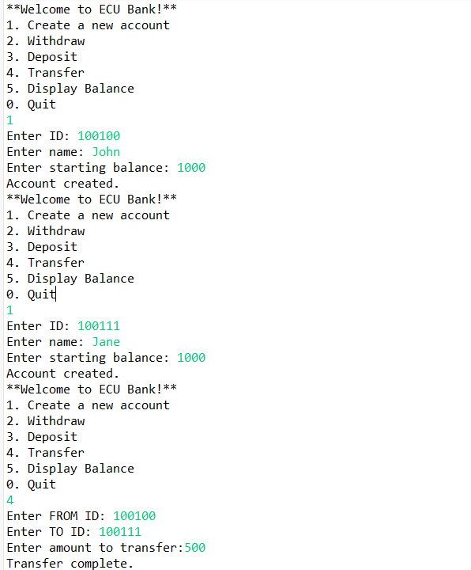

# Java Online Banking System

A menu-driven banking system written in Java using object-oriented programming principles.

## Features
- Create accounts
- Deposit money
- Withdraw money
- Transfer funds between accounts
- Display balances
- Track total accounts and balances

## Concepts Demonstrated
- Object-Oriented Programming (OOP)
- Encapsulation
- Arrays of Objects
- Static Variables/Methods
- Input Validation
- Java Documentation (Javadocs)

## Technologies
- Java
- Console-based interface

## Example Operations
1. Create a new account
2. Deposit funds
3. Withdraw funds
4. Transfer between accounts
5. Display balances

## Screenshot

## Author
Joanna Strader
